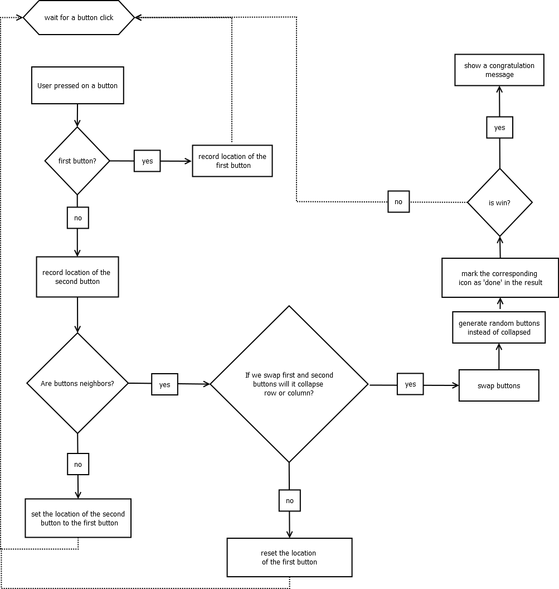

# Kanji Crush
This project is an imitation of [Kanji Crush](http://www.kanjigames.com/kanji-crush.html) game. The user needs to swap two adjacent kanji buttons. The buttons will swap positions only if they match. The purpose of the game is to line up three identical kanji buttons arranged horizontally or vertically. The corresponded hieroglyph is ‘crossed off’ from the target list displayed below the game board. Moreover, the user can see abbreviated information about kanji when clicking on a button.

## Purpose
Might be beneficial for learning Japanese hieroglyphs while playing the game.

## Flowchart of the program

## The main classes

## The main algorithms and data structures
Main data structure: 
* Two-dimentional array of JButtons in the frontend.
* Two-dimetional array of integers, representing the game state in the backend.

Main algorithm:
Swap items in the state array, and reflect that state array in the frontend button array.
1.	Record location of the first clicked button.
    In the frontend we are attaching event listeners to each button in the array of buttons. When click event happens, we search which button has been clicked in the array of buttons. Subsequently, the position of the button is recorded in the button location array.
2.	Record location of the second button.
    Check if the location for the first button has been set. If yes, set the location for the second button.
3.	Check if buttons are neighbors.
    Not every button in the array can be swapped. Utilizing frontend method, we are detecting if the buttons are neighbors, by comparing their positions in the button array. If the buttons are not adjacent, set the position of the second button to the first button.
4.	Swap items in the state array.
    Here, we are passing button locations to the backend method. Essentially, we are swapping items in the state array in the backend. 
5.	Check if row or column will collapse after swapping.
    How do we identify if row or column can be collapsed? 
    First, reset the mask array. Mask array is a two-dimensional array which consists of either integer 0 or 1 (integer 1 represents an item which can be collapsed).
    Second, we iterate through the state array. If we detected a row or a column that can be collapsed, populate the mask array with integer 1. 
    Third, we iterate through the mask array. If we detect integer 1, return with an affirmative response - swapping is feasible.
    a)	If it will not collapse:
      1)	swap back positions of the items in the state array;
      2)	reset the position of the first button in the frontend;
      3)	listen for button click events.

    b)	If it will collapse:
      1)	update the state array;
    We will start by generating random integers (from 0 to 3) in the state array as a substitution of collapsed items, marked as integer 1 in the mask array. 
    Subsequently, we will be repeating method “check if collapse” until we eliminate all items which can be collapsed.
      2)	update button images based on the state array;
      3)	check if the game is over:
        a.	if affirmative – display a congratulation message to the user and finish the game;
        b.	otherwise – continue the game.

## Final overview
The program utilizes Model-View-Controller pattern (MVC) technique, where KanjiCrushBackend class represents the Model (responsible for all business logic for the game), and KanjiCrush class represents the View (responsible for building a layout for the game) and the Controller (responsible for feeding button pushes to the backend).
Also, the program incorporates TestKanjiCrushBackend class which is testing the main algorithm of the game – swapping buttons. It was not feasible to test backend state array which generates random numbers. As a solution, we created TestStateGenerator class with a hard-coded state array. RandomStateGenerator class has been utilized by KanjiCrushBackend class, and TestStateGenerator has been utilized by TestKanjiCrushBackend class.
Besides that, this project demonstrates usage of interfaces. Interfaces are an essential part of bigger projects where solid structure, readability, and unit testing is important. This project incorporates two interfaces: IGenerateState (utilized by TestStateGenerator and RandomStateGenerator classes) and IKanjiBackend (utilized by KanjiCrushBackend). 
The program potentially might grow bigger, by implementing more levels of the game with different sets of hieroglyphs. Moreover, the graphic design of the game’s display needs to be improved.

## Program execution
*	To be able to run the program execute KanjiCrush.java.
* To test the program execute TestKanjiCrush.java.

